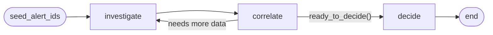

# SOC Triage AI Agent

**Author:** Rômulo Rocha — (https://linkedin.com/in/romrocha)

A personal research project exploring whether an autonomous LLM agent can perform L1 SOC alert triage: correlating alerts into campaigns and identifying false positives — without human intervention.

> **Research question:** Can recursive entity pivoting + vector clustering, orchestrated by a ReAct agent, replace a human analyst in the first triage pass?

This work was presented at two security conferences. Slides are in [`talks/`](talks/):
- **YSTS São Paulo, May 2026** — [`YSTS_SP_May_2026.pdf`](talks/YSTS_SP_May_2026.pdf)
- **FIRST Denver, 2026** — [`First2026_Denver_RomuloRocha_TLPClear.pdf`](talks/First2026_Denver_RomuloRocha_TLPClear.pdf)

Engineering decisions, rejected experiments, and behavioral findings are documented in [`DECISIONS.md`](DECISIONS.md).

---

## How It Works

The system has two layers:

**1. Orchestrator** — `CampaignInvestigationWorkflow.process_queue` drains the `unprocessed` alert queue. For each cycle it selects a seed (via LLM + VectorDB, or chronologically as fallback) and calls the graph once per investigation.

**2. LangGraph graph** — `run_investigation(seed_alert_ids)` runs three independent ReAct LLM nodes, each with its own segmented toolset. There is no deterministic phase.



**Routing** (`route_after_correlate` in `nodes.py`):
- `correlate` called `ready_to_decide` with `status == "ready"` → go to `decide`
- Otherwise → loop back to `investigate`
- **Safety net**: `loop_count >= 3` forces `decide` regardless (prevents infinite loops)

### Graph construction

```python
workflow = StateGraph(InvestigationState)
workflow.add_node("investigate", node_investigate)
workflow.add_node("correlate",   node_correlate)
workflow.add_node("decide",      node_decide)

workflow.set_entry_point("investigate")
workflow.add_edge("investigate", "correlate")
workflow.add_conditional_edges(
    "correlate",
    self._route_after_correlate,
    {"investigate": "investigate", "decide": "decide"},
)
workflow.add_edge("decide", END)
```

---

## Nodes

### `investigate`

Discovers all alerts related to the seed(s) via vector search and entity pivoting.

- **First pass** (`loop_count == 0`): fetches seed payloads via `fetch_alert_by_id` (cap `_MAX_SEED_CHARS = 80_000`)
- **Subsequent loops**: receives `correlation_result.content` from the previous cycle, focused on gaps identified by `correlate`
- **Tools**: `search_similar_alerts`, `search_alerts_by_entity`, `fetch_alert_by_id`
- **Output**: accumulated `investigation_result` + `discovered_alert_ids` delta (seeds + anything seen in `search_*` / `fetch_alert_by_id`) + `alert_cache` delta (seed payloads + any alerts the LLM chose to fetch)
- **Max iterations**: 30
- **Prompt**: `SOC_INVESTIGATE_PROMPT`

### `correlate`

Validates correlations and signals whether the investigation is ready to decide.

- **Input**: `investigation_result.content` + `unique_ids` from `seed_alert_ids ∪ discovered_alert_ids` (read directly from accumulated state via reducers — captures IDs seen only in `search_*` without fetch, which were previously silently lost)
- **Tools**: `validate_shared_entities`, `compute_time_delta`, `ready_to_decide`
- **Output**: `correlation_result` + deltas of `discovered_alert_ids` / `alert_cache`. Increments `loop_count`.
- **Max iterations**: 20
- **Prompt**: `SOC_CORRELATE_PROMPT`

Routing logic:

```python
max_loops = 3

if loop_count >= max_loops:
    return "decide"  # safety net

for t in correlation.tool_outputs:
    if t.tool == "ready_to_decide" and t.output.status == "ready":
        return "decide"

return "investigate"  # loop back
```

### `decide`

Persists the final decision. Builds its context from:
- `investigation_result.content` and `correlation_result.content`
- Seed payloads: read from `alert_cache` first; SQLite fallback on miss (delta returned to state)
- Discovered alerts: read from `alert_cache` where payload exists (compact format, `MAX_CHARS = 60_000`)
- `validate_shared_entities` and `compute_time_delta` outputs from `correlate`
- `ready_to_decide.summary` if present, highlighted as "Correlation Conclusion"
- `prior_decisions`

**Tools**: `create_campaign`, `add_alerts_to_campaign`, `mark_false_positive`

**Retry guard**: if the LLM finishes without calling a decision tool, a second `_react_loop` (`max_iterations=30`) explicitly instructs it to act — mitigates the classic ReAct "describe instead of call" failure.

**Output**: `campaign_result` with aggregated `tool_outputs` from **all nodes** (investigation + correlation + decide), preserving full traceability.

- **Max iterations**: 50
- **Prompt**: `SOC_DECIDE_PROMPT`

### `select_seeds` (orchestrator node)

Standalone ReAct loop run by `process_queue` before each `run_investigation` when `use_llm_seed_selection=True`. Not part of the internal graph.

- **Tools**: `list_unprocessed_summary`, `submit_selected_seeds`
- **Limit**: 1 seed per call (`MAX_SEEDS_PER_BATCH = 1`)
- **Max iterations**: 15
- **Fallback**: if the LLM returns `[]`, seeds are chosen chronologically via `get_unprocessed_alerts`
- **Prompt**: `SOC_SELECT_SEEDS_PROMPT`

---

## Tools per Node

| Tool | Node | Action |
|------|------|--------|
| `search_similar_alerts` | `investigate` | Vector search (ChromaDB) |
| `search_alerts_by_entity` | `investigate` | Exact pivot on `observables` (SQLite) |
| `fetch_alert_by_id` | `investigate` | Full alert payload (also used directly by `node_correlate` / `node_decide` to fetch seeds outside the loop) |
| `validate_shared_entities` | `correlate` | Shared observables across alert IDs |
| `compute_time_delta` | `correlate` | Time span and gaps |
| `ready_to_decide` | `correlate` | Explicit readiness signal |
| `create_campaign` | `decide` | Persist new campaign |
| `add_alerts_to_campaign` | `decide` | Merge alerts into existing campaign |
| `mark_false_positive` | `decide` | Mark alert as FP |
| `list_unprocessed_summary` | `select_seeds` | Queue summary (up to 200 alerts) |
| `submit_selected_seeds` | `select_seeds` | Submit selected seed IDs |
| `get_unprocessed_alerts` | orchestrator | Direct queue drain (not exposed to LLM) |

---

## Graph State (`InvestigationState`)

Defined in `langgraph_workflow.py` as `TypedDict(total=False)`:

| Field | Type | Set by | Description |
|-------|------|--------|-------------|
| `seed_alert_ids` | `List[str]` | input | Initial alerts chosen by the orchestrator |
| `investigation_result` | `Dict\|None` | `node_investigate` | `{action, content, tool_outputs}` accumulated across loops |
| `correlation_result` | `Dict\|None` | `node_correlate` | `{action, content, tool_outputs}` of the last correlation |
| `loop_count` | `int` | `node_correlate` | Number of `investigate → correlate` cycles executed |
| `discovered_alert_ids` | `Set[str]` (reducer: union) | all nodes | All IDs seen by search/fetch tools. `_merge_discovered_ids` does set union. |
| `alert_cache` | `Dict[str, Dict]` (reducer: merge, right-wins) | `node_investigate`, `node_decide` | Full alert payloads indexed by `alert_id`. New keys accumulate; existing keys get the latest payload. Lets `decide` skip re-fetching seeds. |
| `campaign_result` | `Dict\|None` | `node_decide` | Final output: action + aggregated `tool_outputs` from all nodes |
| `prior_decisions` | `str\|None` | orchestrator | Summary of campaigns already created in the same `process_queue` run |
| `run_id` | `str` | orchestrator | Run ID propagated to tools and tracing |
| `model_name` | `str` | config | OpenAI model used by all ReAct loops |
| `temperature` | `float` | config | Typically `0.0` |

> Fields annotated with `Annotated[T, reducer]` are accumulated — each node returns only its delta and LangGraph merges it with the existing state. This eliminates fragile `tool_outputs` re-parsing and provides free I/O caching across nodes.

---

## ReAct Loop (`_react_loop`)

Shared by all three nodes and `select_seeds`, implemented in `nodes.py`:

1. Instantiates `ChatOpenAI(model, temperature)` with `bind_tools(tools_spec, tool_choice="auto")`
2. Sends `SystemMessage(node prompt)` + `HumanMessage(context built by the node)`
3. Per step up to `max_iterations`:
   - Calls `llm.invoke(messages, config=langsmith_cfg)`
   - If response has no `tool_calls` → returns `action="llm_finish"`
   - Otherwise executes each via `FUNCTION_REGISTRY[name](args, tool_cfg)`, logs, appends `ToolMessage` to history (truncated at 16 KB)
4. On `max_iterations` → returns `action="tool_step_limit"`

Return shape: `{"action": "llm_finish"|"tool_step_limit", "content": str, "tool_outputs": List[{tool, output}], "discovered": Set[str], "cache_delta": Dict[str, Dict]}`

`discovered` and `cache_delta` are extracted automatically per tool call via `_extract_tool_discoveries(tool_name, output)`:
- `search_similar_alerts` / `search_alerts_by_entity` → add `output.alert_ids` to `discovered`
- `fetch_alert_by_id` → adds `alert_id` to `discovered` and full payload to `cache_delta`
- `find_similar_cluster` → adds anchor + each `cluster[i].alert_id` to `discovered`
- Other tools (decision, correlation) → no contribution

Each `llm.invoke` and tool call receives a `RunnableConfig` via `_langsmith_config(state, node_name)` / `_langsmith_tool_config(state, node_name, tool_name)` — adds `run_name`, `tags=["soc-agent", node_name]`, `metadata={run_id, graph_node}` so LangSmith nests child runs correctly under the parent investigation.

---

## Anti-reprocessing

- Campaigns persist in SQLite. `process_queue` loads `list_campaign_alert_ids()` at startup and skips seeds already in a campaign (`already_associated`).
- After each investigation, IDs explicitly touched by the LLM (from `create_campaign`, `add_alerts_to_campaign`, `mark_false_positive` tool outputs) are added to `already_associated`.
- Seeds that entered the investigation but were not explicitly acted on are marked `not_evaluated` — separate from `false_positive` — for auditability.
- Before each `run_investigation`, `_build_prior_decisions` builds a short summary of existing campaigns and passes it via `prior_decisions`, so the LLM can call `add_alerts_to_campaign` instead of creating duplicates.

---

## Running the Experiment

The full pipeline lives in `notebooks/experiment.ipynb`. Follow these steps in order.

---

### Step 1 — Install dependencies

```bash
git clone https://github.com/romrocha/SOC_triage_AI_agent.git
cd SOC_triage_AI_agent
pip install -r requirements.txt   # Python 3.11+ recommended
```

---

### Step 2 — Verify the installation with pytest

Before running any experiment, confirm that the agent logic and ingestion layer are working correctly:

```bash
pytest
```

All tests run without network access or API keys — they use in-memory SQLite and mock LLM calls. Expected output: **13 tests passing** in under 10 seconds.

| Test file | What it covers |
|-----------|---------------|
| `test_alert_cache.py` | Alert cache accumulator and reducer |
| `test_alert_date_parse.py` | Date parsing edge cases |
| `test_campaign_dedupe.py` | Campaign deduplication logic |
| `test_chroma_store.py` | ChromaDB store interface |
| `test_config.py` | Config path resolution from `RESEARCH_ROUND` |
| `test_eval.py` | Evaluation metrics computation |
| `test_ground_truth.py` | Ground truth CSV generation |
| `test_langgraph_workflow.py` | Full graph wiring and routing |
| `test_report_export.py` | Report export formatting |
| `test_sqlite_reset.py` | SQLite reset between runs |
| `test_state_accumulators.py` | LangGraph state reducers |
| `test_store_singleton.py` | SQLite connection singleton |
| `test_utils_datetime.py` | Datetime helpers |

If any test fails, fix it before running the notebook — a failing test usually means a broken dependency or missing config.

---

---

### Step 2 — Configure credentials

```bash
cp .env.example .env
```

Edit `.env`:

```env
OPENAI_API_KEY=sk-...        # required
MODEL_NAME=gpt-4o-mini       # any OpenAI chat model; this is the only variable between experiments

# Optional — enables LangSmith tracing (recommended for inspecting agent traces)
LANGCHAIN_TRACING_V2=true
LANGCHAIN_API_KEY=lsv2_...
LANGCHAIN_PROJECT=soc-agent
```

---

### Step 3 — Choose a round and open the notebook

```bash
export RESEARCH_ROUND=round1_no_ioc   # options: round1_no_ioc · round2_no_ioc · round3_no_ioc
jupyter lab notebooks/experiment.ipynb
```

The three rounds use identical alert content with different time windows (1 day / 4 months / 6 months). Start with `round1_no_ioc`.

---

### Step 4 — Run Cell 1: Setup check

Verifies that all dependencies are importable and loads the `.env` file. If any import fails, fix it before continuing.

---

### Step 5 — Run Cell 2: Ingest alerts

Loads the round's JSON alerts into SQLite and generates vector embeddings in ChromaDB:

```
data/alerts.db    ← alert store (100 alerts)
data/chroma_db/   ← embeddings (all-MiniLM-L6-v2)
```

> To reset between experiments: `rm -rf data/alerts.db data/chroma_db`

---

### Step 6 — Run Cell 3–4: Execute the agent

The agent autonomously triages all 100 alerts. For each seed it:
1. **Investigates** — searches for related alerts via entity pivoting and vector similarity
2. **Correlates** — validates shared entities and time relationships
3. **Decides** — writes the result to SQLite: campaign, merge into existing campaign, or false positive

```
select_seeds → investigate → correlate ⇄ investigate → decide
```

Expected: **~25–30 min**, **~$0.90** with `gpt-4o-mini`.

Watch the output for live logging. The agent prints each investigation as it completes.

---

### Step 7 — Run Cell 5: Inspect results

Prints the alert status breakdown from SQLite:

| Status | Meaning |
|--------|---------|
| `in_campaign` | Grouped into a campaign by the agent |
| `false_positive` | Marked as noise by the agent |
| `not_evaluated` | Entered an investigation but the LLM did not explicitly act on it |
| `unprocessed` | Not yet reached |

---

### Step 8 — Run Cell 6: Evaluate against ground truth

Generates `ground_truth.csv` (if missing) and scores the agent's decisions:

| Metric | What it measures |
|--------|-----------------|
| Overall Accuracy | Correct labels / total alerts |
| Campaign Recall | Fraction of campaign alerts correctly grouped |
| Campaign Precision | Fraction of grouped alerts that are truly campaign |
| Purity | Single-campaign dominance within each detected cluster |
| Completeness | Correct campaign membership across clusters |
| FP F1 | False positive detection quality |
| Missed threats | Campaign alerts incorrectly marked FP |

Results are printed inline and appended to `data/eval_runs.csv`.

---

### Step 9 — Run Cell 8: Export the report

Writes results to `output/round1_no_ioc/`:

```
round1_no_ioc_results_<model>_<timestamp>.txt   ← campaign list + metrics
round1_no_ioc_agent_<model>_<timestamp>.log     ← full execution log
```

---

### Step 10 — (Optional) Run Cell 9–10: History and cost

- **Cell 9** — compares metrics across all runs from `data/eval_runs.csv`
- **Cell 10** — shows token cost and latency from local logs + LangSmith traces

---

### Repeating with another model or round

1. Change `MODEL_NAME` in `.env`
2. Reset storage: `rm -rf data/alerts.db data/chroma_db`
3. Re-run cells 2 → 4 → 5 → 6 → 8

To switch rounds, also change `RESEARCH_ROUND` and restart the kernel before step 3.

---

## Dataset

Datasets live in `input/roundN_no_ioc/`. Each round uses a **TheHive-style JSON layout**: one folder per label group with `*.json` files inside.

```
input/round1_no_ioc/
├── campaing-a/          # Campaign A — finance ransomware
├── campaing-b/          # Campaign B — HR insider threat
├── noise/               # False-positive noise alerts
├── ground_truth.csv     # Generated by scripts/generate_ground_truth.py
└── manifest.json        # Round metadata
```

Ground truth is assigned **mechanically from folder path** — not from alert content. `alert_id` equals `sourceRef`.

### Design choices

1. **Synthetic over real data** — Full ground truth, no PII, reproducible generation, safe to share.
2. **TheHive JSON** — Open schema used in production SOCs; preserves L1 triage field shapes.
3. **Time as the only cross-round variable** — Round 1 is canonical (1-day window); rounds 2–3 rescale `date` linearly. All other fields are identical.
4. **Deterministic generation** — Campaign and noise specs are Python dataclass literals; no RNG.
5. **No IOC leakage** — Observable `ioc` and `sighted` fields are absent. In a real SOC those are the *output* of L1 triage, not the input — pre-marking them would hand the agent a shortcut label.

### Rounds

| Round | Time window | Notes |
|-------|-------------|-------|
| `round1_no_ioc` | 1 day (2024-11-27) | Baseline, canonical alert specs |
| `round2_no_ioc` | 4 months (Jan–Apr 2024) | Same alerts, dates scaled ×90 |
| `round3_no_ioc` | 6 months (Jul–Dec 2024) | Same alerts, dates scaled ×180 |

### Regenerating datasets from scratch

The datasets are included in the repo and don't need regeneration for normal use:

```bash
# Regenerate round 1 (canonical specs)
python input/scripts/regenerate_round1_dataset.py
# → writes to input/round1_no_ioc/

# Derive rounds 2 and 3 (time scaling only — round 1 is the single source of truth)
python input/scripts/regenerate_temporal_variants.py
# → writes to input/round2_no_ioc/ and input/round3_no_ioc/

# Regenerate ground truth for all rounds
python scripts/generate_ground_truth.py --round round1_no_ioc
python scripts/generate_ground_truth.py --round round2_no_ioc
python scripts/generate_ground_truth.py --round round3_no_ioc
```

See `input/schema.md` for the full alert schema and per-round changelog.

---

## Directory Map

| Path | Role |
|------|------|
| `security_agent/app/agent/langgraph_workflow.py` | Workflow, graph, routing |
| `security_agent/app/agent/nodes.py` | Nodes and `_react_loop` |
| `security_agent/app/agent/tools.py` | Tools, `FUNCTION_REGISTRY`, OpenAI schemas |
| `security_agent/app/agent/prompts.py` | System prompts per node |
| `security_agent/app/ingestion/sqlite_store.py` | SQLite persistence |
| `security_agent/app/ingestion/chroma_store.py` | Vector store (Chroma) |
| `security_agent/app/ingestion/json_loader.py` | JSON ingestion and embeddings |
| `security_agent/app/experiments/eval.py` | Evaluation against ground truth |
| `security_agent/app/utils/` | Pure helpers — no I/O, no domain deps (e.g. `parse_alert_datetime`). Importable from any layer. |
| `scripts/` | Evaluation CLI entry-points (`argparse` + `sys.exit`) |
| `input/scripts/` | Dataset generation scripts |
| `notebooks/experiment.ipynb` | Full pipeline: ingest → test → production → reports |
| `input/` | Alert datasets per round |
| `output/` | Agent logs and evaluation reports |
| `talks/` | Conference slides (YSTS SP 2026, FIRST Denver 2026) |


**Dependency direction:** `scripts/ → app/experiments/ → app/ingestion/`, with `app/utils/` callable from anywhere.

The `app/experiments/` folder is an importable library (ground truth, metrics, export) — not throwaway scripts. It is consumed by the notebook and by `scripts/`. Entry-points with `argparse` live in `scripts/` only.

---

## Tests

```bash
pytest
```

See `pytest.ini` and `tests/` for configuration and coverage.
